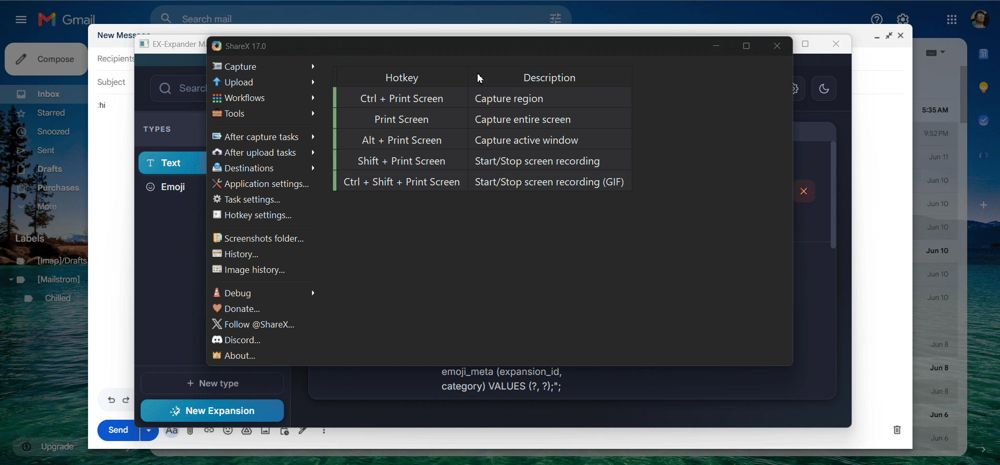

# EX-Expander

> Type a shortcode, pick from a popup, and your expansion is inserted — anywhere, instantly.

<!-- Replace with your actual demo GIF -->

---

## Download & Install

1. Go to [**Releases**](https://github.com/srnafi/EX-Expander/releases/latest) and download `EX-Expander.exe`
2. Run it — no installation needed
3. It lives in your system tray, ready to go

> **Note:** Requires the [WebView2 Runtime](https://developer.microsoft.com/en-us/microsoft-edge/webview2/) — already present on most Windows 10/11 machines.

---

## Features

- **Popup suggestion list** — as you type, matching expansions appear instantly; navigate with arrow keys and insert with Enter
- **Works everywhere** — browsers, editors, chat apps, terminals — any focused window
- **Custom trigger character** — use `:`, `;`, or whatever you prefer
- **Space or symbol triggering** — choose what fires the expansion
- **Per-app scoping** — limit expansions to specific apps or keep them global
- **Expansion manager** — add, edit, and organize expansions through a built-in UI
- **Auto-start on login** — optionally launch with Windows
- **Clipboard-safe** — your clipboard is saved and restored around every insertion

---

## Built With

C++ · Win32 API · WebView2 · SQLite

---

## License

All rights reserved © srnafi
